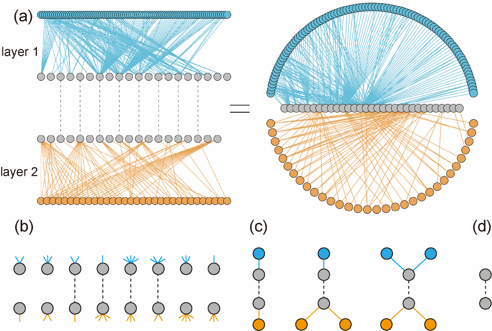

<!-- README.md is generated from README.Rmd. Please edit that file -->

# ILSM

<!-- badges: start -->
<!-- badges: end -->

In view of the analysis of the structural characteristics of the
multilayer network (species-sharing species-other species) has been
complete, however, there is still a lack of a unified operation that can
quickly obtain the corresponding characteristics of the multilayer
network and explore Mesoscale structure of the network (motif). To solve
this insufficiency, ‘ILSM’ was designed for supporting calculating such
metrics of multilayer networks by functions of R package.

The visualization of an example multilayer interaction network with
three parties of nodes and two interaction layers (a, two common forms
in literature) and interconnection structures (b, interconnection
pattern, c, interconnection motif, d, versatility). Different colors of
nodes indicate different parties of species, and the dashed lines
indicate the shared species. (a) The shared species in the left panel
were indicated by dashed links, and those in the right panel have links
from both layers.



## Installation

<!-- Installing the development version from CRAN: -->
<!-- ```{r echo = TRUE, eval = FALSE} -->
<!-- install.packages("ILSM") -->
<!-- ``` -->

You can install the development version of ILSM from GitHub:

``` r
devtools::install_github("WeichengSun/ILSM")
```

## motif guideline of Multilayer network


In multilayer network, 48 types of motifs of nodes ranging from 3 to 6
are shown. The green squares, cyan circles, and blue squares represent
the first, second, and third groups of nodes of the network,
respectively. The graph in the first row represents only one node in the
middle group with increasing complexity, similarly, the graph in the
second to fourth rows represents a motif with two nodes in the middle
group, and finally the motif in the fifth row represents a motif with
three nodes node in the middle group, which also tends to be the most
complex. The numbers from 1 to 70 in the cyan circle represent the roles
in which the 70 nodes are located.

## Example

This is a basic example which shows you how to solve a common problem:

``` r
library(ILSM)
## generate a network
set.seed(12)
N <- build_net(11,15,16,0.2)

## calculate the frequency of motifs
icmotif_count(N)

## measure the roles of connector node
icmotif_role(N)

## Five interconnection pattern
coid(N)
cois(N)
poc(N)
pc(N)
hc(N)

## examine node versatility
node_cv(N)
```

## License

The code is released under the MIT license (see LICENSE file).

## References

Simmons, B. I., Sweering, M. J., Schillinger, M., Dicks, L. V.,
Sutherland, W. J., & Di Clemente, R. (2019). bmotif: A package for motif
analyses of bipartite networks. Methods in Ecology and Evolution, 10(5),
695-701.

Mora, B.B., Cirtwill, A.R. and Stouffer, D.B., 2018. pymfinder: a tool
for the motif analysis of binary and quantitative complex networks.
bioRxiv, 364703.

Domínguez-García, V., & Kéfi, S. (2024). The structure and robustness of
ecological networks with two interaction types. PLOS Computational
Biology, 20(1), e1011770.

Sauve, A. M., Thébault, E., Pocock, M. J., & Fontaine, C. (2016). How
plants connect pollination and herbivory networks and their contribution
to community stability. Ecology, 97(4), 908-917.

Pilosof, S., Porter, M. A., Pascual, M., & Kéfi, S. (2017). The
multilayer nature of ecological networks. Nature Ecology & Evolution,
1(4), 0101.
