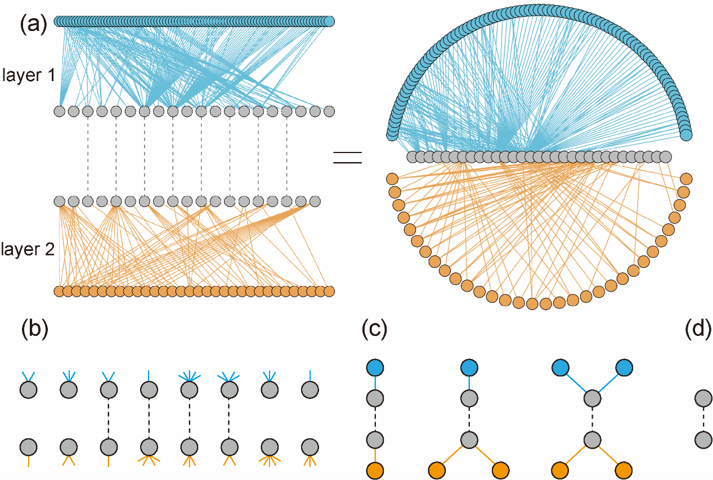
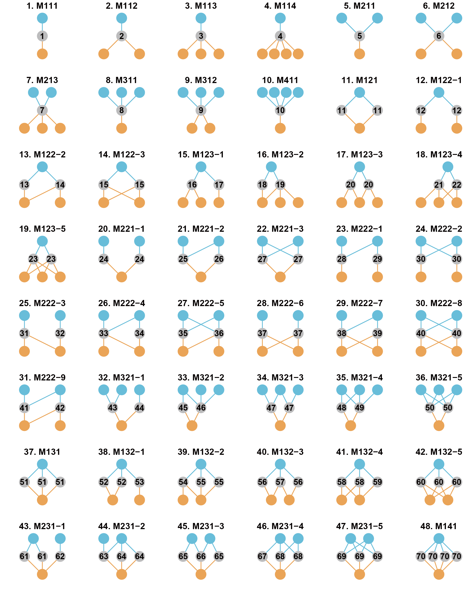

<!-- README.md is generated from README.Rmd. Please edit that file -->

# ILSM

<!-- badges: start -->
<!-- badges: end -->

ILSM is designed for analyzing interconnection structures including
interconnection patterns, versatility and motifs in multilayer
interaction networks.

The figure below shows an example multilayer interaction network (a,
with three groups of species and two interaction layers, showing two
common forms) and interconnection structures (b, interconnection
pattern, c, interconnection motif, d, versatility). Different colors of
nodes indicate different groups of species, and the dashed lines
indicate the connector species. In panel a, the connector species in the
left panel were indicated by dashed links, and those in the right panel
have links from both layers.



## Installation

You can install the development version of ILSM from GitHub:

``` r
devtools::install_github("WeichengSun/ILSM")
```

## Interconnection motifs



The figure below shows the 48 forms of interconnection motifs with 3-6
nodes. Blue and grey nodes form one layer, and grey and orange nodes
form the other layer. Grey nodes are connector nodes. The motifs are
named “MABC-i”: M means “motif’,”A” is the number of a-nodes, “B” is the
number of b-nodes, “C” is the number of c-nodes and “i” is the serial
number for the motifs with the same “ABC”. The interconnection motifs
are ordered by the number of connector nodes (from 1 to 4). The numbers
from 1 to 70 in connector nodes represent the unique roles.

## Example

This is an example showing the uses of different functions:

``` r
library(ILSM)
## generate a random multilayer network
set.seed(12)
Net <- build_net(11,15,16,0.2)# This funciton creats a two-layered network with 11,15, 16 nodes in three groups and the connectance is 0.2 

##Or use a pollinator-plant-herbivore network from Villa-Galaviz et. al. 2020. Journal of Animal Ecology.
data(PPH_Coltparkmeadow)
Net <- PPH_Coltparkmeadow

## calculate the frequency of interconnection motifs
icmotif_count(Net)

##the roles of connector node within interconnection motifs
icmotif_role(Net)

## Five interconnection patterns
poc(Net)
coid(Net)
cois(Net)
pc(Net)
hc(Net)

## connector nodes' versatility
node_cv(Net)
```

## License

The code is released under the MIT license (see LICENSE file).

## References

Simmons, B. I., Sweering, M. J., Schillinger, M., Dicks, L. V.,
Sutherland, W. J., & Di Clemente, R. (2019). bmotif: A package for motif
analyses of bipartite networks. Methods in Ecology and Evolution, 10(5),
695-701.

Mora, B.B., Cirtwill, A.R. and Stouffer, D.B., 2018. pymfinder: a tool
for the motif analysis of binary and quantitative complex networks.
bioRxiv, 364703.

Domínguez-García, V., & Kéfi, S. (2024). The structure and robustness of
ecological networks with two interaction types. PLOS Computational
Biology, 20(1), e1011770.

Sauve, A. M., Thébault, E., Pocock, M. J., & Fontaine, C. (2016). How
plants connect pollination and herbivory networks and their contribution
to community stability. Ecology, 97(4), 908-917.

Pilosof, S., Porter, M. A., Pascual, M., & Kéfi, S. (2017). The
multilayer nature of ecological networks. Nature Ecology & Evolution,
1(4), 0101.

Domenico, M. D. 2022. Multilayer Networks: Analysis and Visualization.
Introduction to muxViz with R. . Springer, Cham.
